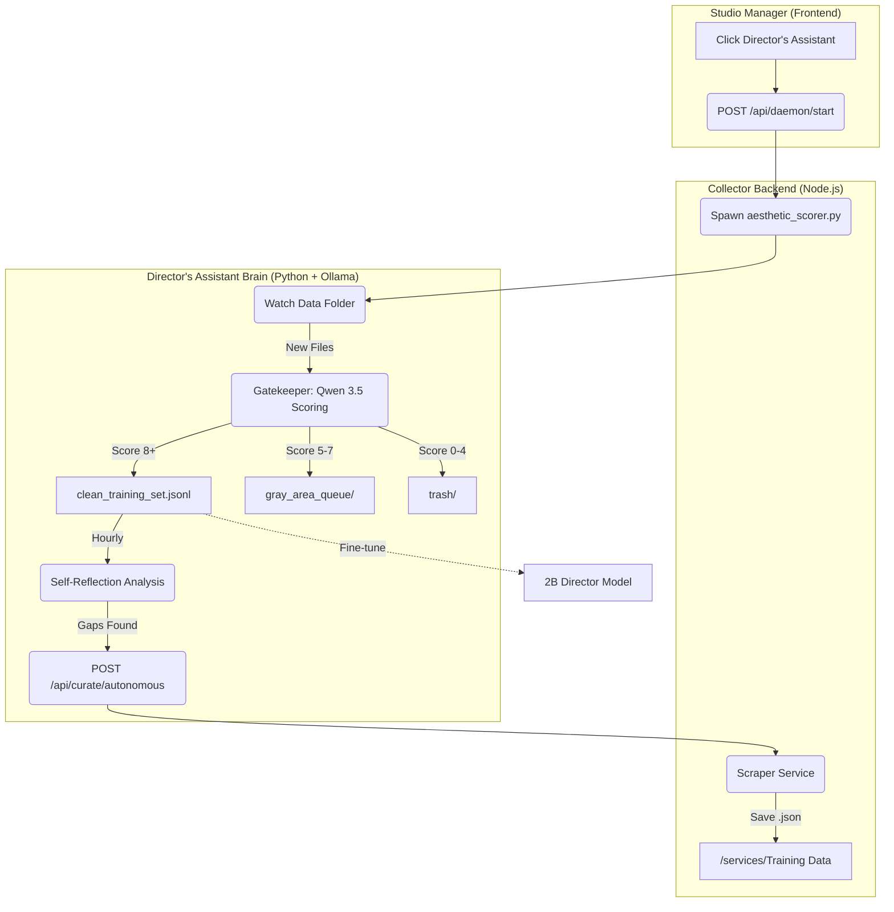

# Director's Assistant: Autonomous Training Collector

This module is the "brain" of the autonomous studio, responsible for identifying, scraping, curating, and scoring training data to fine-tune the AI Director model.

## Core Components

1.  **Autonomous Scorer (`aesthetic_scorer.py`)**:
    *   Runs on the 5090 Engine Room via Ollama (`qwen3.5:9b`).
    *   Acts as a **Gatekeeper**, scoring cinematic data and routing it to Clean, Gray, or Trash folders.
    *   Implements a **Learning Loop** that analyzes the dataset hourly to identify coverage gaps.

2.  **Collector Server (`server.ts`)**:
    *   Provides the UI for manual curation and dashboarding.
    *   Manages the lifecycle of the Python daemon (Start/Stop/Status).
    *   Hosts the **Autonomous Scraper Service** which responds to the scorer's gap analysis.

3.  **Reflective Brain (`scraper_service.ts`)**:
    *   Uses **Gemini 3.1 Flash-Lite** to search and curate high-quality filmmaking techniques from YouTube and articles.

## Hybrid Learning System

The studio employs a dual-layered approach to learning and dataset coverage:

1.  **Macro-Tracking (The React Dashboard):**
    *   A static, deterministic quota system (e.g., 200 "Prompt Craft" examples, 100 "Camera Work" examples).
    *   **Purpose:** Provides a visual health check of the dataset in the UI, ensuring all major categories are represented before fine-tuning begins.
2.  **Micro-Discovery (The Python Loop):**
    *   An LLM-driven reflection cycle inside `aesthetic_scorer.py` that reads the `clean_training_set.jsonl`.
    *   **Purpose:** Discovers nuanced gaps *within* the macro categories (e.g., noticing the dataset lacks "dutch angles" despite hitting the generic "camera work" quota) and dispatches highly targeted search queries to the Scraper Service.

## System Workflow

## Directory Structure

*   `aesthetic_scorer.py`: Main autonomous loop and aesthetic evaluator.
*   `server.ts`: Express server for UI and API orchestration.
*   `daemon_manager.ts`: Process management for the Python loop.
*   `scraper_service.ts`: Server-side autonomous curation logic.
*   `src/`: Vite/React frontend for manual dataset management.

## Usage

1.  **Automatic**: Click the "Director's Assistant" button in the LTX Studio Manager. The daemon will start automatically on the 5090.
2.  **Manual**: Open `http://localhost:3000` to search for specific topics or audit the "Gray Area" queue.
3.  **Maintenance**: Use the Stop button in the collector UI to release VRAM when production is complete.
